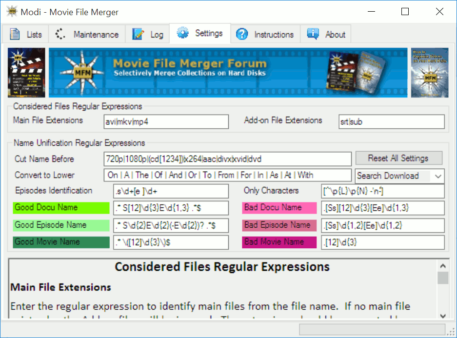

# MFM Settings

The Settings tab contains all settings to adjust MFM to the style of your collection. Anyway, if you follow my style, then there should not be too much need to change any of the settings.

Most of the settings are regular expressions.  See the chapter Regular Expressions at the end of MFM Settings for more information.

## Considered Files Settings
MFM only considers files which have certain extensions.  Files which are not relevant are ignored.

### Video Files Extension
The Video Files Extension regular expression identifies main video files.  If no main file exists also the add-on files will be ignored.  Keep the list as short as possible to speed up the file processing.  Add all wanted video file extensions separated with a vertical line `|`.

### Add-on Files Extension
The Add-on Files Extension identified add-on files like subtitles or posters.  Add-on files will be only considered if a main video file exists.  Add all wanted add-on file extensions separated with a vertical line `|`.

## Name Unification Settings
MFM tries to unify the names of items, so that they can be better read and compared.

### Cut Name Before
The Cut Name Before regular expression tells MFM what not to include in the name.  Everything after, including the match itself, will be removed from the item name.  For example the year is good to remove, because the same movie can have different years in different collections.  The disadvantage is that two different item with the same name, but a different year, will be treated as one.  This regular expression is a little bit more complicated; please consult the Regular Expression Explanation chapter for more information.

### Only Characters
The Only Characters regular expression tells MFM which characters to accept.  All other characters will be removed from the item name.  The only character regular expression has to start with `[^` and end with `]`.  All characters, which should be included in the unified item name, have to be written in the middle.

### Convert to Lower
MFM capitalizes the first letter of each word in a name by default, to make the item name easier to read.  The Convert to Lower regular expression tells MFM which words in the name to convert to lower case.  The convert to lower regular expression contains the articles between spaces `_` (not by underscore as can be seen here) separated by a vertical line `|`.

### Episodes Identification
The Episodes Identification regular expression tells MFM where to find the episode identification in the file name.  The episode identification has to contain 2 numbers of which the first number is for the season and the second number for the episode.  Episode names will be truncated after the episode identification.  Series names will be truncated before the episode identification.  The regular expression `\d+` means a number with any amount of digits.  Different episode identifications have to be separated by a vertical line `|`.

## Regular Expressions
Regular expressions can be very complicated, but MFM uses just basic regular expressions and it should be possible to figure out how they work by looking at the standard settings.

Regular expressions can be tested on the [Rubular website](http://rubular.com).

An over view of regular expression can be found on [Wikipedia](http://en.wikipedia.org/wiki/Regular_expression) from where also the following excerpt is. You can find it also directly on the Setting tab, where regular expressions are used in MFM.

A regular expression, often called a pattern, is an expression that specifies a set of strings.  To specify such sets of strings, rules are often more concise than lists of a set's members.  For example, the set containing the three strings "Handel", "Händel", and "Haendel" can be specified by the pattern `H(ä|ae?)ndel` (or alternatively, it is said that the pattern matches each of the three strings).  In most formalisms, if there exists at least one regex that matches a particular set then there exist an infinite number of such expressions.  Most formalisms provide the following operations to construct regular expressions.

Boolean "or":  A vertical bar separates alternatives. For example, `gray|grey` can match "gray" or "grey".

Grouping:  Parentheses are used to define the scope and precedence of the operators (among other uses).  For example, `gray|grey` and `gr(a|e)y` are equivalent patterns which both describe the set of "gray" and "grey".

Quantification:  A quantifier after a token (such as a character) or group specifies how often that preceding element is allowed to occur. The most common quantifiers are the question mark `?`, the asterisk `*` (derived from the Kleene star), and the plus sign `+` (Kleene cross).

The question mark `?` indicates there is zero or one of the preceding element. For example, `colou?r` matches both "color" and "colour".

The asterisk `*` indicates there is zero or more of the preceding element. For example, `ab*c` matches "ac", "abc", "abbc", "abbbc", and so on.

The plus sign `+` indicates there is one or more of the preceding element. For example, `ab+c` matches "abc", "abbc", "abbbc", and so on, but not "ac".

These constructions can be combined to form arbitrarily complex expressions, much like one can construct arithmetical expressions from numbers and the operations +, −, ×, and ÷. For example, `H(ae?|ä)ndel` and `H(a|ae|ä)ndel` are both valid patterns which match the same strings as the earlier example, `H(ä|ae?)ndel`.

